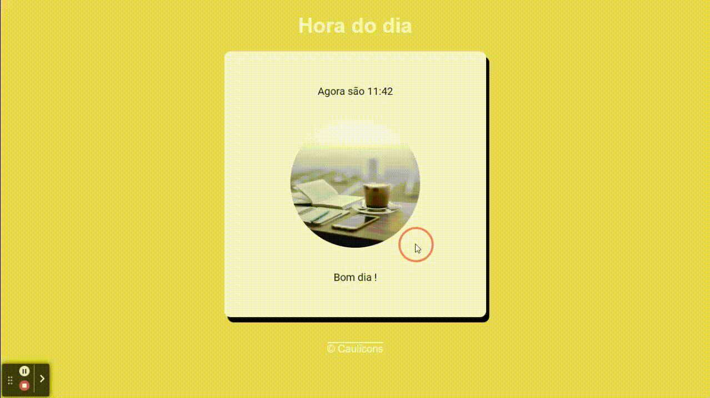

# Que horas são ?

Repassando aqui esse mini-projeto que fiz vendo os cursos do canal do YouTube: Curso em Vídeo, do professor Gustavo Guanabara na playlist de JavaScript patrocinada pelo Google.

Esse mini-projeto foi ótimo para dá aquela revisada básica em tratamentos de dados, e lógica de programação com JS.
Além de ver as funcionalidades de alguns objetos globais do JavaScript como o Date é sempre bom porquê ser for fazer realmente na mão iria leva uma eternidade. Como ninguém é eterno então é sempre bom saber as horas ⏱.

Caso queiram da uma olhada no site, só clicar [aqui](https://lnkd.in/gebkWEyy).
